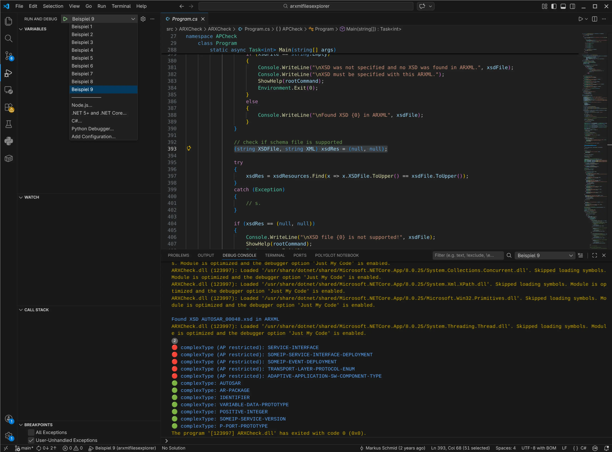

# ARXMLFilesExplorer - ARXCheck

Das Tool soll ein paar einfache Zwecke erfüllen:

* Validieren großer `.arxml`-Dateien (GByte-Größe) gegen ein Autosar `Xsd`-Schema.
* Auflisten aller in einer `.arxml`-Datei verwendeten `Xsd`-Datentypen (`complex` / ~~`simple`~~).
* Unterschiedliche Kennzeichnung der in der `.arxml`-Datei verwendeten _adaptive_ mit 🔴 (im Sinne von: "AP Only") und _classic_ mit 🟢 (im Sinne von: _not_ "AP Only") Autosar-Datentypen.

`ARXCheck` ist eine [.NET 8.0](https://dotnet.microsoft.com/en-us/download/dotnet/8.0) Konsolenanwendung.

# Repository

```bash
├── ARXCheckConfig.xml
├── build
│   ├── config
│   │   └── xsd
│   │       └── xml.xsd
│   ├── examples
│   │   ├── LICENSE_EXAMPLES.txt
│   │   ├── NOTICE.md
│   │   ├── sample01.arxml
│   │   ├── sample02.arxml
│   │   ├── sample03.arxml
│   │   ├── sample04.arxml
│   │   ├── sample05.arxml
│   │   └── sample06.arxml
│   ├── global.json
│   ├── main.xqy
│   ├── publish.zsh
│   └── setup.zsh
├── CHANGELOG.md
├── .gitignore
├── img
│   └── screen01.webp.png
├── LICENSE
├── README.md
├── src
│   └── ARXCheck
│       ├── ARXCheck
│       │   ├── ARXCheck.csproj
│       │   ├── ConsoleHelper.cs
│       │   ├── icon.ico
│       │   ├── Program.cs
│       │   ├── Resources.Designer.cs
│       │   └── Resources.resx
│       └── ARXCheck.sln
└── .vscode
    ├── launch.json
    └── tasks.json
```

# Plattform

Für Weiterentwicklung und Build (_Buildtime_) oder nur Verwendung (_Runtime_) gibt es ein paar Voraussetzungen an die Plattformen.

## Buildtime

Das Tool kann nur auf Plattformen mit `Z-Shell` gebaut werden. Alle Voraussetzungen:

* **BaseX**: Für die Verarbeitung der `Xsd`-Daten mittels XQuery sowie die Verwaltung der Datenbank.
* **.NET SDK (Version 8.0)**: Erforderlich für Build des .Net Projekts.
* **Z-Shell (zsh)**: Voraussetzung für Setup und Build.
* **GNU Wget**: Zum Herunterladen der Autosar `Xsd` Schema Files im Setup.
* **Visual Studio Code**: Als Entwicklungsumgebung und zum Debuggen. Erweiterungen:
    * [C# Dev Kit](https://marketplace.visualstudio.com/items?itemName=ms-dotnettools.csdevkit)
    * [.NET Runtime Install Tool](https://marketplace.visualstudio.com/items?itemName=ms-dotnettools.vscode-dotnet-runtime)
    * [.NET Extension Pack](https://marketplace.visualstudio.com/items?itemName=ms-dotnettools.vscode-dotnet-pack)

Neben dem Tool muss im selben Pfad ein `xsd` Verzeichnis mit den Autosar-Schema `*.xsd` Dateien liegen.

## Runtime

Als Commandline Tool gibt es für die "Self-Contained"-Variante der Executables keine Voraussetzungen. Für die "Not Self-Contained"-Variante braucht man eine [.NET Runtime](https://dotnet.microsoft.com/en-us/download/dotnet/8.0).

* **BaseX (optional)**: Nützlich für die Durchführung manueller `XPath 2.0`-Abfragen außerhalb des Funktionsumfangs von `ARXCheck`.

# Build

Der Quellcode (`.cs`) ist als [VS Project](src/ARXCheck/) gebündelt.

Es gibt ein Build-Skript [publish.zsh](build/publish.zsh) zum Kompilieren ("Publish") aller Binärdateien auf der Entwicklerplattform mit `zsh` und `.NET SDK`. Das Skript kopiert zudem Autosar-`Xsd` Files und Beispieldateien in das Verzeichnis der Executables.

## Setup

Die Autosar-`Xsd`-Dateien werden in einem Setup-Schritt heruntergeladen. Anschließend kann das Projekt gebaut werden.

```bash
./build/setup.zsh
```

```bash
Verarbeite: https://www.autosar.org/fileadmin/standards/R17-03_R1.1.0/AP/AUTOSAR_MMOD_XMLSchema.zip
  Erfolgreich entpackt.
...
Verarbeite: https://www.autosar.org/fileadmin/standards/R20-11/FO/AUTOSAR_MMOD_XMLSchema.zip
  Erfolgreich entpackt.
Erstelle BaseX Datenbank 'XSD' neu...
Überprüfe Import...
Erfolg: Die Datenbank ist aktuell und enthält exakt 12 Dateien.
...
"Outfile = /home/user/Projekte/gitrepos/arxmlfilesexplorer/src/ARXCheck/ARXCheck/input/AUTOSAR_00051.xml"
"Aktualisiere Resources.resx"
```

## Publish

Erstellt die Executables für die Plattformen:

- win-x64
- linux-x64
- osx-x64
- osx-arm64

```bash
./build/publish.zsh
```

```bash
Erstellen von Erfolgreich in 0,2s
Wiederherstellung abgeschlossen (0,6s)
  ARXCheck net8.0 win-x64 Erfolgreich (2,0s) → bin/windows/SelfContained/ARXCheck/
...
```

> ⚠️ Danach sollten im `./bin` Verzeichnis die Binaries liegen:
>
>  <details>
>  <summary>Verzeichnisstruktur anzeigen</summary>
>
> ```bash
>  ├── linux
>  │   ├── NotSelfContained
>  │   │   └── ARXCheck
>  │   │       ├── ARXCheck
>  │   │       ├── ARXCheck.pdb
>  │   │       ├── LICENSE_EXAMPLES.txt
>  │   │       ├── NOTICE.md
>  │   │       ├── sample01.arxml
>  │   │       ├── sample02.arxml
>  │   │       ├── sample03.arxml
>  │   │       ├── sample04.arxml
>  │   │       ├── sample05.arxml
>  │   │       ├── sample06.arxml
>  │   │       └── xsd
>  │   │           ├── AUTOSAR_00042.xsd
>  │   │           ├── AUTOSAR_00043.xsd
>  │   │           ├── AUTOSAR_00044.xsd
>  │   │           ├── AUTOSAR_00045.xsd
>  │   │           ├── AUTOSAR_00046.xsd
>  │   │           ├── AUTOSAR_00047.xsd
>  │   │           ├── AUTOSAR_00048.xsd
>  │   │           ├── AUTOSAR_00049.xsd
>  │   │           ├── AUTOSAR_00050.xsd
>  │   │           ├── AUTOSAR_00051.xsd
>  │   │           ├── AUTOSAR_00052.xsd
>  │   │           ├── AUTOSAR_00053.xsd
>  │   │           └── xml.xsd
>  │   └── SelfContained
>  │       └── ARXCheck
>  │           ├── ARXCheck
>  │           ├── ARXCheck.pdb
>  │           ├── LICENSE_EXAMPLES.txt
>  │           ├── NOTICE.md
>  │           ├── sample01.arxml
>  │           ├── sample02.arxml
>  │           ├── sample03.arxml
>  │           ├── sample04.arxml
>  │           ├── sample05.arxml
>  │           ├── sample06.arxml
>  │           └── xsd
>  │               ├── AUTOSAR_00042.xsd
>  │               ├── AUTOSAR_00043.xsd
>  │               ├── AUTOSAR_00044.xsd
>  │               ├── AUTOSAR_00045.xsd
>  │               ├── AUTOSAR_00046.xsd
>  │               ├── AUTOSAR_00047.xsd
>  │               ├── AUTOSAR_00048.xsd
>  │               ├── AUTOSAR_00049.xsd
>  │               ├── AUTOSAR_00050.xsd
>  │               ├── AUTOSAR_00051.xsd
>  │               ├── AUTOSAR_00052.xsd
>  │               ├── AUTOSAR_00053.xsd
>  │               └── xml.xsd
>  ├── macos-arm64
>  │   ├── NotSelfContained
>  │   │   └── ARXCheck
>  │   │       ├── ARXCheck
>  │   │       ├── ARXCheck.pdb
>  │   │       ├── LICENSE_EXAMPLES.txt
>  │   │       ├── NOTICE.md
>  │   │       ├── sample01.arxml
>  │   │       ├── sample02.arxml
>  │   │       ├── sample03.arxml
>  │   │       ├── sample04.arxml
>  │   │       ├── sample05.arxml
>  │   │       ├── sample06.arxml
>  │   │       └── xsd
>  │   │           ├── AUTOSAR_00042.xsd
>  │   │           ├── AUTOSAR_00043.xsd
>  │   │           ├── AUTOSAR_00044.xsd
>  │   │           ├── AUTOSAR_00045.xsd
>  │   │           ├── AUTOSAR_00046.xsd
>  │   │           ├── AUTOSAR_00047.xsd
>  │   │           ├── AUTOSAR_00048.xsd
>  │   │           ├── AUTOSAR_00049.xsd
>  │   │           ├── AUTOSAR_00050.xsd
>  │   │           ├── AUTOSAR_00051.xsd
>  │   │           ├── AUTOSAR_00052.xsd
>  │   │           ├── AUTOSAR_00053.xsd
>  │   │           └── xml.xsd
>  │   └── SelfContained
>  │       └── ARXCheck
>  │           ├── ARXCheck
>  │           ├── ARXCheck.pdb
>  │           ├── LICENSE_EXAMPLES.txt
>  │           ├── NOTICE.md
>  │           ├── sample01.arxml
>  │           ├── sample02.arxml
>  │           ├── sample03.arxml
>  │           ├── sample04.arxml
>  │           ├── sample05.arxml
>  │           ├── sample06.arxml
>  │           └── xsd
>  │               ├── AUTOSAR_00042.xsd
>  │               ├── AUTOSAR_00043.xsd
>  │               ├── AUTOSAR_00044.xsd
>  │               ├── AUTOSAR_00045.xsd
>  │               ├── AUTOSAR_00046.xsd
>  │               ├── AUTOSAR_00047.xsd
>  │               ├── AUTOSAR_00048.xsd
>  │               ├── AUTOSAR_00049.xsd
>  │               ├── AUTOSAR_00050.xsd
>  │               ├── AUTOSAR_00051.xsd
>  │               ├── AUTOSAR_00052.xsd
>  │               ├── AUTOSAR_00053.xsd
>  │               └── xml.xsd
>  ├── macos-x64
>  │   ├── NotSelfContained
>  │   │   └── ARXCheck
>  │   │       ├── ARXCheck
>  │   │       ├── ARXCheck.pdb
>  │   │       ├── LICENSE_EXAMPLES.txt
>  │   │       ├── NOTICE.md
>  │   │       ├── sample01.arxml
>  │   │       ├── sample02.arxml
>  │   │       ├── sample03.arxml
>  │   │       ├── sample04.arxml
>  │   │       ├── sample05.arxml
>  │   │       ├── sample06.arxml
>  │   │       └── xsd
>  │   │           ├── AUTOSAR_00042.xsd
>  │   │           ├── AUTOSAR_00043.xsd
>  │   │           ├── AUTOSAR_00044.xsd
>  │   │           ├── AUTOSAR_00045.xsd
>  │   │           ├── AUTOSAR_00046.xsd
>  │   │           ├── AUTOSAR_00047.xsd
>  │   │           ├── AUTOSAR_00048.xsd
>  │   │           ├── AUTOSAR_00049.xsd
>  │   │           ├── AUTOSAR_00050.xsd
>  │   │           ├── AUTOSAR_00051.xsd
>  │   │           ├── AUTOSAR_00052.xsd
>  │   │           ├── AUTOSAR_00053.xsd
>  │   │           └── xml.xsd
>  │   └── SelfContained
>  │       └── ARXCheck
>  │           ├── ARXCheck
>  │           ├── ARXCheck.pdb
>  │           ├── LICENSE_EXAMPLES.txt
>  │           ├── NOTICE.md
>  │           ├── sample01.arxml
>  │           ├── sample02.arxml
>  │           ├── sample03.arxml
>  │           ├── sample04.arxml
>  │           ├── sample05.arxml
>  │           ├── sample06.arxml
>  │           └── xsd
>  │               ├── AUTOSAR_00042.xsd
>  │               ├── AUTOSAR_00043.xsd
>  │               ├── AUTOSAR_00044.xsd
>  │               ├── AUTOSAR_00045.xsd
>  │               ├── AUTOSAR_00046.xsd
>  │               ├── AUTOSAR_00047.xsd
>  │               ├── AUTOSAR_00048.xsd
>  │               ├── AUTOSAR_00049.xsd
>  │               ├── AUTOSAR_00050.xsd
>  │               ├── AUTOSAR_00051.xsd
>  │               ├── AUTOSAR_00052.xsd
>  │               ├── AUTOSAR_00053.xsd
>  │               └── xml.xsd
>  └── windows
>      ├── NotSelfContained
>      │   └── ARXCheck
>      │       ├── ARXCheck.exe
>      │       ├── ARXCheck.pdb
>      │       ├── LICENSE_EXAMPLES.txt
>      │       ├── NOTICE.md
>      │       ├── sample01.arxml
>      │       ├── sample02.arxml
>      │       ├── sample03.arxml
>      │       ├── sample04.arxml
>      │       ├── sample05.arxml
>      │       ├── sample06.arxml
>      │       └── xsd
>      │           ├── AUTOSAR_00042.xsd
>      │           ├── AUTOSAR_00043.xsd
>      │           ├── AUTOSAR_00044.xsd
>      │           ├── AUTOSAR_00045.xsd
>      │           ├── AUTOSAR_00046.xsd
>      │           ├── AUTOSAR_00047.xsd
>      │           ├── AUTOSAR_00048.xsd
>      │           ├── AUTOSAR_00049.xsd
>      │           ├── AUTOSAR_00050.xsd
>      │           ├── AUTOSAR_00051.xsd
>      │           ├── AUTOSAR_00052.xsd
>      │           ├── AUTOSAR_00053.xsd
>      │           └── xml.xsd
>      └── SelfContained
>          └── ARXCheck
>              ├── ARXCheck.exe
>              ├── ARXCheck.pdb
>              ├── LICENSE_EXAMPLES.txt
>              ├── NOTICE.md
>              ├── sample01.arxml
>              ├── sample02.arxml
>              ├── sample03.arxml
>              ├── sample04.arxml
>              ├── sample05.arxml
>              ├── sample06.arxml
>              └── xsd
>                  ├── AUTOSAR_00042.xsd
>                  ├── AUTOSAR_00043.xsd
>                  ├── AUTOSAR_00044.xsd
>                  ├── AUTOSAR_00045.xsd
>                  ├── AUTOSAR_00046.xsd
>                  ├── AUTOSAR_00047.xsd
>                  ├── AUTOSAR_00048.xsd
>                  ├── AUTOSAR_00049.xsd
>                  ├── AUTOSAR_00050.xsd
>                  ├── AUTOSAR_00051.xsd
>                  ├── AUTOSAR_00052.xsd
>                  ├── AUTOSAR_00053.xsd
>                  └── xml.xsd  ```
>  </details>

# Beispiele

Man kann die Beispiele in `Visual Studio Code` oder in der `Z-Shell` Konsole ausführen.

## Visual Studio Code

In `VS Code` sind die Beispiele im [`launch.json`](./.vscode/launch.json) vordefiniert. Man kann sie darüber direkt debuggen oder starten:

<p align="center">

</p>

## Z-Shell

> ⚠️ Um die Beispiele in der Konsole auszuführen, wechselt man erst in das richtige Verzeichnis für die Runtime Plattform. Also unter Linux nach `./bin/linux/SelfContained/ARXCheck/` oder falls mindestens eine `.NET Runtime` installiert ist, nach `./bin/linux/NotSelfContained/ARXCheck/`.

```bash
cd ./bin/linux/SelfContained/ARXCheck/
```

oder falls die `.NET Runtime` installiert ist:

```bash
cd ./bin/linux/NotSelfContained/ARXCheck/
```

## Beispiel 1

Usage ausgeben:

```bash
./ARXCheck
```

```bash
Description:
Performs some checks on the ARXML File.

Usage:
ARXCheck [options]

Options:
-x, --arxml <arxml>    Specify the ARXMLFILE.
-s, --xsd <xsd>        If XSDFILE is specified, it is used instead of the schemaLocation in the ARXML file.
-c, --config <config>  Specify the CONFIGFILE.
-v                     List schema validation warnings and errors.
-p, --xpath <xpath>    List XPath expressions with XPATHFORMAT:
						XPATHFORMAT = 0 : No XPath
						XPATHFORMAT = 1 : Valid XPath
						XPATHFORMAT = 2 : Human-readable 'Path'
--version              Show version information
-?, -h, --help         Show help and usage information

Supported XSDFILE values:

AUTOSAR_00043.xsd
AUTOSAR_00042.xsd
AUTOSAR_00045.xsd
AUTOSAR_00044.xsd
AUTOSAR_00047.xsd
AUTOSAR_00046.xsd
AUTOSAR_00049.xsd
AUTOSAR_00048.xsd
AUTOSAR_00050.xsd
AUTOSAR_00051.xsd
AUTOSAR_00052.xsd
AUTOSAR_00053.xsd
```

## Beispiel 2

Version ausgeben:

```bash
./ARXCheck --version
```

```bash
1.0.10.0+...
```

## Beispiel 3

Ein `.arxml` File abfragen:

```bash
./ARXCheck -x sample04.arxml
```

```bash
Found XSD AUTOSAR_00043.xsd in ARXML

🟢 complexType: AUTOSAR
...
```

## Beispiel 4

Die `Xsd` Schema Version, die im `.arxml` File referenziert wird, ist nicht vorhanden:

```bash
./ARXCheck -x sample03.arxml
```

```bash
Found XSD AUTOSAR_4-0-3.xsd in ARXML

XSD file AUTOSAR_4-0-3.xsd is not supported!
Description:
  Performs some checks on the ARXML File.

Usage:
  ARXCheck [options]

Options:
  -x, --arxml <arxml>    Specify the ARXMLFILE.
  -s, --xsd <xsd>        If XSDFILE is specified, it is used instead of the schemaLocation in the ARXML file.
  -c, --config <config>  Specify the CONFIGFILE.
  -v                     List schema validation warnings and errors.
  -p, --xpath <xpath>    List XPath expressions with XPATHFORMAT:
                         XPATHFORMAT = 0 : No XPath
                         XPATHFORMAT = 1 : Valid XPath
                         XPATHFORMAT = 2 : Human-readable 'Path'
  --version              Show version information
  -?, -h, --help         Show help and usage information


Supported XSDFILE values:

AUTOSAR_00043.xsd
AUTOSAR_00042.xsd
AUTOSAR_00045.xsd
AUTOSAR_00044.xsd
AUTOSAR_00047.xsd
AUTOSAR_00046.xsd
AUTOSAR_00049.xsd
AUTOSAR_00048.xsd
AUTOSAR_00050.xsd
AUTOSAR_00051.xsd
AUTOSAR_00052.xsd
AUTOSAR_00053.xsd
```

Im [`ARXCheckConfig.xml`](./ARXCheckConfig.xml) gibt es ein Mapping von `AUTOSAR_4-3-0` nach `AUTOSAR_00043`, das man mit `-c` nutzen kann:

```bash
./ARXCheck -x sample03.arxml -c <Pfad zum Mapping File>/ARXCheckConfig.xml       

```

```bash
Found XSD AUTOSAR_00043.xsd in ARXML

🟢 complexType: AUTOSAR
🟢 complexType: AR-PACKAGE
...
```

## Beispiel 5

Es ist kein Autosar Schema im `.arxml` definiert:

```bash
./ARXCheck -x sample01.arxml
```

```bash
XSD was not specified and no XSD was found in ARXML.
...
```

Man gibt die Autosar Schema Version explizit mit `-s` an:

```bash
./ARXCheck -x sample01.arxml -s AUTOSAR_00045.xsd
```

```bash
🟢 complexType: AUTOSAR
...
```

## Beispiel 6

Mit `-p` bekommt man die _Complex Types_ Pfade angezeigt. 

Die Anwendung unterscheidet zwei Pfadarten:

* `-p=1` : es werden gültige `XPath 2.0` Ausdrücke ausgegeben
* `-p=2` : es werden die Namen der `AR-PACKAGE` Knoten ausgegeben

Option `-p=1`:

```bash
./ARXCheck -x sample02.arxml -s AUTOSAR_00048.xsd -p=1
```  

```bash
🟢 complexType: AUTOSAR
	/*:AUTOSAR[1]
🟢 complexType: AR-PACKAGE
	/*:AUTOSAR[1]/*:AR-PACKAGES[1]/*:AR-PACKAGE[1]
...
	/*:AUTOSAR[1]/*:AR-PACKAGES[1]/*:AR-PACKAGE[1]/*:AR-PACKAGES[1]/*:AR-PACKAGE[5]/*:AR-PACKAGES[1]/*:AR-PACKAGE[2]
🟢 complexType: IDENTIFIER
	/*:AUTOSAR[1]/*:AR-PACKAGES[1]/*:AR-PACKAGE[1]/*:SHORT-NAME[1]
...
	/*:AUTOSAR[1]/*:AR-PACKAGES[1]/*:AR-PACKAGE[1]/*:AR-PACKAGES[1]/*:AR-PACKAGE[1]/*:ELEMENTS[1]/*:APPLICATION-SW-COMPONENT-TYPE[1]/*:INTERNAL-BEHAVIORS[1]/*:SWC-INTERNAL-BEHAVIOR[1]/*:RUNNABLES[1]/*:RUNNABLE-ENTITY[1]/*:DATA-WRITE-ACCESSS[1]/*:VARIABLE-ACCESS[1]/*:SHORT-NAME[1]
...
🟢 complexType: I-SIGNAL-TO-I-PDU-MAPPING
	/*:AUTOSAR[1]/*:AR-PACKAGES[1]/*:AR-PACKAGE[1]/*:AR-PACKAGES[1]/*:AR-PACKAGE[5]/*:AR-PACKAGES[1]/*:AR-PACKAGE[2]/*:ELEMENTS[1]/*:I-SIGNAL-I-PDU[1]/*:I-SIGNAL-TO-PDU-MAPPINGS[1]/*:I-SIGNAL-TO-I-PDU-MAPPING[1]
...
	/*:AUTOSAR[1]/*:AR-PACKAGES[1]/*:AR-PACKAGE[1]/*:AR-PACKAGES[1]/*:AR-PACKAGE[5]/*:AR-PACKAGES[1]/*:AR-PACKAGE[2]/*:ELEMENTS[1]/*:I-SIGNAL-I-PDU[4]/*:I-SIGNAL-TO-PDU-MAPPINGS[1]/*:I-SIGNAL-TO-I-PDU-MAPPING[1]

```

Man kann, die `XPath 2.0` Pfade die man per `-p=1` bekommt, direkt verwenden, um mit einer `Xslt` Engine, die das unterstützt (z.B. BaseX) die referenzierten Knoten aus dem `.arxml` File auszugeben:

```bash
basex -i sample02.arxml "/*:AUTOSAR[1]/*:AR-PACKAGES[1]/*:AR-PACKAGE[1]/*:AR-PACKAGES[1]/*:AR-PACKAGE[1]/*:ELEMENTS[1]/*:APPLICATION-SW-COMPONENT-TYPE[1]/*:INTERNAL-BEHAVIORS[1]/*:SWC-INTERNAL-BEHAVIOR[1]/*:RUNNABLES[1]/*:RUNNABLE-ENTITY[1]/*:DATA-WRITE-ACCESSS[1]/*:VARIABLE-ACCESS[1]/*:SHORT-NAME[1]"
```  

```bash
<SHORT-NAME xmlns="http://autosar.org/schema/r4.0" xmlns:xsi="http://www.w3.org/2001/XMLSchema-instance">dataWriteAccess_DoorMain_Status_Locked</SHORT-NAME>
```

## Beispiel 7

Option `-p=2`:

```bash
./ARXCheck -x sample02.arxml -s AUTOSAR_00048.xsd -p=2
``` 

```bash
🟢 complexType: AUTOSAR
	
🟢 complexType: AR-PACKAGE
	/Demo
...
	/Demo/EDC/Communication/I-SIGNAL-I-PDU[4]
🟢 complexType: I-SIGNAL-TO-I-PDU-MAPPING
	/Demo/EDC/Communication/I-SIGNAL-I-PDU[1]/I-SIGNAL-TO-PDU-MAPPINGS[1]/I-SIGNAL-TO-I-PDU-MAPPING[1]
...
	/Demo/EDC/Communication/I-SIGNAL-I-PDU[4]/I-SIGNAL-TO-PDU-MAPPINGS[1]/I-SIGNAL-TO-I-PDU-MAPPING[1]

```

## Beispiel 8

Ein nicht Schema-valides `.arxml` File, das Adaptive und Classic Elemente enthält:

```bash
./ARXCheck -x sample05.arxml -v
```  

```bash
Found XSD AUTOSAR_00048.xsd in ARXML

Error XML validation: 

Message: The element 'SYMBOL-PROPS' in namespace 'http://autosar.org/schema/r4.0' has invalid child element 'SHORT-NAMEE' in namespace 'http://autosar.org/schema/r4.0'. List of possible elements expected: 'SHORT-NAME' in namespace 'http://autosar.org/schema/r4.0'.

🔴 complexType: SERVICE-INTERFACE
🔴 complexType: ADAPTIVE-APPLICATION-SW-COMPONENT-TYPE
🔴 complexType: STD-CPP-IMPLEMENTATION-DATA-TYPE
🟢 complexType: AUTOSAR
🟢 complexType: AR-PACKAGE
🟢 complexType: IDENTIFIER
🟢 complexType: SYMBOL-PROPS
🟢 complexType: VARIABLE-DATA-PROTOTYPE
🟢 complexType: P-PORT-PROTOTYPE
🟢 complexType: CATEGORY-STRING
```

## Beispiel 9

Ein Schema-valides `.arxml` File, das Adaptive und Classic Elemente enthält:

```bash
./ARXCheck -x sample06.arxml -v
```

```bash
Found XSD AUTOSAR_00048.xsd in ARXML

🔴 complexType: SERVICE-INTERFACE
🔴 complexType: SOMEIP-SERVICE-INTERFACE-DEPLOYMENT
🔴 complexType: SOMEIP-EVENT-DEPLOYMENT
🔴 complexType: TRANSPORT-LAYER-PROTOCOL-ENUM
🔴 complexType: ADAPTIVE-APPLICATION-SW-COMPONENT-TYPE
🟢 complexType: AUTOSAR
🟢 complexType: AR-PACKAGE
🟢 complexType: IDENTIFIER
🟢 complexType: VARIABLE-DATA-PROTOTYPE
🟢 complexType: POSITIVE-INTEGER
🟢 complexType: SOMEIP-SERVICE-VERSION
🟢 complexType: P-PORT-PROTOTYPE
```

> Hinweis: `SOMEIP-SERVICE-VERSION` ist `mmt.RestrictToStandards="CP,AP"` deswegen grün 🟢, usw.

# Referenzen

  * [BaseX Startup](https://docs.basex.org/main/Startup): Doku zu `BaseX`
  * [.NET 8](https://dotnet.microsoft.com/download): Version der Entwicklungsplattform zur Kompilierung des Quellcodes (im Projekt aktuell auf Basis von .Net 8.0)
  * [Zsh](https://zsh.sourceforge.io/Doc/): Handbuch der verwendeten Shell für die Skripte
  * [GNU Wget](https://www.gnu.org/software/wget/): Zum Herunterladen der Autosar `Xsd` Schema Files im setup Schritt
  * [AUTOSAR](https://www.autosar.org/standards): Autosar Seite, von der auch die `Xsd` Schema Files geladen werden